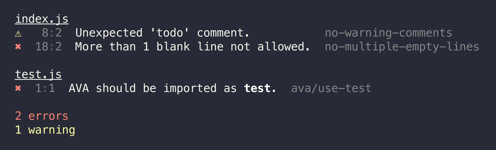

# eslint-formatter-pretty

> Pretty formatter for [ESLint](https://eslint.org)



## Highlights

- Pretty output.
- Sorts results by severity.
- Stylizes inline codeblocks in messages.
- Command-click a rule ID to open its docs.
- Command-click a header to reveal the first error in your editor. *(iTerm-only)*

## Install

```sh
npm install --save-dev eslint-formatter-pretty@5
```

*To use this with ESLint, use version 5. Version 6 is [not compatible with ESLint](https://github.com/eslint/eslint/issues/15560).*

## Usage

### [XO](https://github.com/xojs/xo)

Nothing to do. It's the default formatter.

### ESLint CLI

```sh
eslint --format=pretty file.js
```

### [grunt-eslint](https://github.com/sindresorhus/grunt-eslint)

```js
grunt.initConfig({
	eslint: {
		target: ['file.js'].
		options: {
			format: 'pretty'
		}
	}
});

grunt.loadNpmTasks('grunt-eslint');
grunt.registerTask('default', ['eslint']);
```

### [gulp-eslint](https://github.com/adametry/gulp-eslint)

```js
import gulp from 'gulp';
import eslint from 'gulp-eslint';

export const lint = (
	gulp.src('file.js')
		.pipe(eslint())
		.pipe(eslint.format('pretty'))
);
```

### [eslint-loader](https://github.com/MoOx/eslint-loader) *(webpack)*

```js
import eslintFormatterPretty from 'eslint-formatter-pretty';

export default {
	entry: ['file.js'],
	module: {
		rules: [
			{
				test: /\.js$/,
				exclude: /node_modules/,
				loader: 'eslint-loader',
				options: {
					formatter: eslintFormatterPretty
				}
			}
		]
	}
};
```

## Tips

In iTerm, <kbd>Command</kbd>-click the filename header to open the file in your editor.

In [terminals with support for hyperlinks](https://gist.github.com/egmontkob/eb114294efbcd5adb1944c9f3cb5feda#supporting-apps), <kbd>Command</kbd>-click the rule ID to open its docs.
